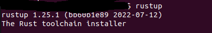
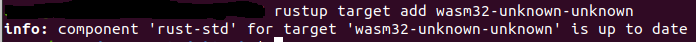
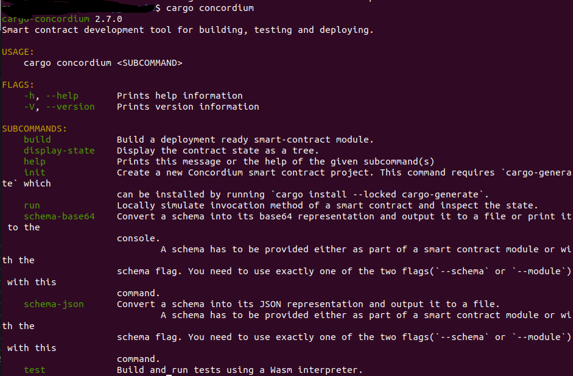
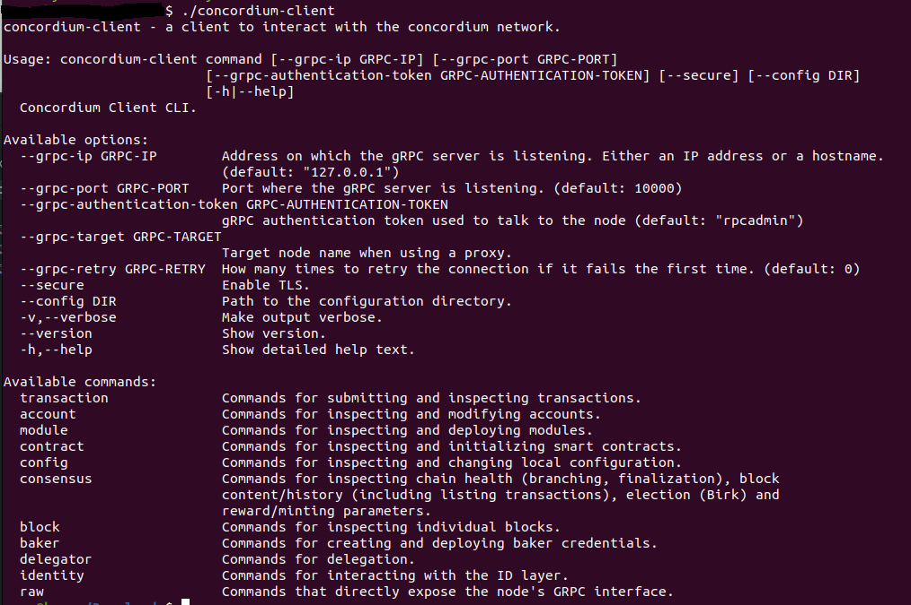
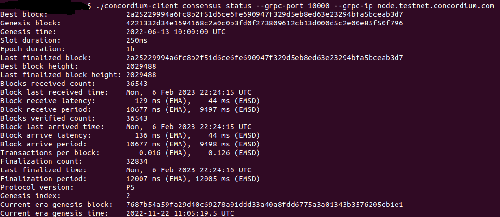
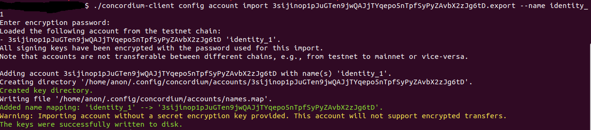

# Concordium Task 1

## Wallet Addresses:

Concordium Address: 3sijinop1pJuGTen9jwQAJjTYqepo5nTpfSyPyZAvbX2zJg6tD
USDT Address: 0x154D63EAd2987b6a02645A44158ac1037e27E605

## Process:

1: Install rust via `curl --proto '=https' --tlsv1.2 -sSf https://sh.rustup.rs | sh`

2: Install wasm via `rustup target add wasm32-unknown-unknown`

3: Download and installed the Concordium software package:

4: Install the concordium client:

5: A wallet was setup in the chrome browsers extension and an account was created on the testnet. The account was then exported from the browser wallet and imported into the concordium client.

